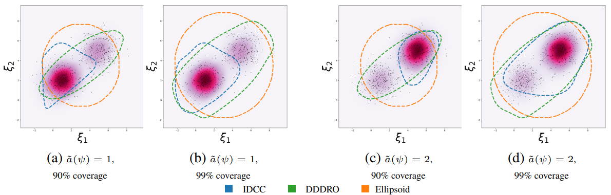

# Introduction:
## What is CRO and why is it important?

In the contextual optimization problem, a decision maker tries to solve a decision-making problem that has uncertainty in the distribution of parameters of objective and constraints, but some covariates (or features) contribute to the random parameters that can be exploited. 

Having covariates available to aid in determining the distribution of uncertain parameters has been shown to be valuable in many fields. For instance, in scenarios such as navigating through a city, data on weather and time of day can help resolve uncertainties surrounding traffic congestion and assist in finding the shortest route. Similarly, when it comes to portfolio optimization, historical stock prices and market sentiment expressed on Twitter can impact future stock returns.

## Notations:
In a simple cost minimization problem, let $
\mathcal{X} \subseteq \mathbb{R}^n$ and $c(x, \xi)
$ respectively be the feasible
set of actions and a cost that depends on both the action $x$ and a random perturbation vector $\xi \in \mathbb{R}^m$. The decision maker has access to a vector of covariates $\psi \in \mathbb{R}^m$ that are assumed to be correlated to $\xi$.

In the conditional stochastic optimization problem, decision maker tries to identify optimal policy $\boldsymbol{x}^*$,  dependent on $\psi$, that is the solution to the following minimization problem:

$$
\begin{equation}
\boldsymbol{x}^*(\psi) \in \underset{x \in \mathcal{X}}{\operatorname{argmin}} \mathbb{E}[c(x, \xi) \mid \psi]
\end{equation}
$$

That is, optimal action (policy) is the one in  $\mathcal{X}$ that minimizes the expectation of cost function $c$ when $\psi$ is known.

In the conditional robust optimization problem, decision maker tries to get optimal policy $\boldsymbol{x}^*$, that minimizes worst-case loss, i.e., $\max _{\xi \in \mathcal{U}(\psi)} c(x, \xi)$:

$$
\begin{equation}
\boldsymbol{x}^*(\psi):=\underset{x \in \mathcal{X}}{\operatorname{argmin}} \max _{\xi \in \mathcal{U}(\psi)} c(x, \xi),
\end{equation}
$$

where, $\xi$ is sampled from ambiguity set $\mathcal{U}(\psi)$, given covariates $\psi$.

# How did related works solve problems related to the CRO?

Previous works exert one-class classification technique in designing uncertainty set for robust optimization. Natarajan et al., 2008 used variance and covariance of historical data. Goerigk and Kurtz, 2020 applied deep neural networks to learn uncertainty set. Fard et al., 2020 tried to jointly learn the lower dimensional representation of data and cluster with k-means. But none of them tried to exploit deep neural networks representation learning to create lower representation of data, and jointly used clustering to create uncertainty set from covariate information correlated to random parameters $\xi$.

# The Deep Data-Driven Robust Optimization (DDDRO) Approach: 
Goerigk and Kurtz, 2020 proposed using deep neural networks to create uncertainty set $\mathcal{U}$ as follow:
$$
\begin{equation}
\mathcal{U}(W, R):=\left\lbrace \xi \in \mathbb{R}^m:\left\|f_W(\xi)-\bar{f}_0\right\| \leq R\right\rbrace
\end{equation}
$$
where, $f_W: \mathbb{R}^m \rightarrow \mathbb{R}^d$ is a deep neural networks, with parameters $W$, that map random variables $\xi$ to a new representation in which uncertainty set $\mathcal{U}$ can be obtained around center $\bar{f}_0$ with radius $R$.

$\bar{f}_0$ is the center of cluster, where $W_o$ represents some initial random parameters of deep neural networks:

Given dataset $\mathcal{D}_{\xi}=\left\lbrace\xi_1, \xi_2 \ldots \xi_N\right\rbrace$ they suggest to minimize the corresponding loss function of one-class classification, i.e., the empirical centered total variation of the projected data points:

<!-- $$
\begin{equation}
\min _W \frac{1}{N} \sum_{i=1}^N\left\|f_W\left(\xi_i\right)-\bar{f}_0\right\|^2
\end{equation}
$$ -->

The design of the neural network's layers is based on a concept called constraint generation. Constraint generation is about adding filters that make a reduced uncertainty set $\mathcal{U'}$, containing worst-case loss in original set $\mathcal{U}$. Their proposed deep neural network makes uncertainty set $\mathcal{U}(W,R)$: 

<!-- $$
\begin{equation}
\mathcal{U}(W, R)=\left\lbrace\begin{array}{c}
\xi;\begin{array}{c}
\exists u \in\{0,1\}^{d \times K \times L}, \zeta \in \mathbb{R}^{d \times L}, \phi \in \mathbb{R}^{d \times L} \\
\sum_{k=1}^K u_j^{k, \ell}=1, \forall j, \ell \\
\phi^1=W^1 \xi \\
\zeta^L_j = \sum_{j=1}^K u_{j}^{k, \ell} a_k^{\ell} \phi_j^{\ell}+\sum_{k=1}^K u_j^{k, \ell} b_k^{\ell}, \forall j, \ell \\
\phi^{\ell}=W^{\ell} \zeta^{\ell-1}, \forall \ell \geq 2 \\
\sum_{k=1}^K u_j^{k, \ell}{\underline{\alpha}}_k^{\ell} \leq \phi_j^{\ell} \leq \sum_{k=1}^K u_j^{k, \ell} \bar{\alpha}_k^{\ell}, \forall j, \ell \\
\left\|\zeta^L-\bar{f}_0\right\| \leq R
\end{array}
\end{array}\right\rbrace,
\end{equation}
$$ -->

where $\phi^{\ell}$ is the output at $\ell$-th layer of neural networks, and $a_k^{\ell}, b_k^{\ell}, {\underline{\alpha}}_k^{\ell}, \bar{\alpha}_k^{\ell}$ are parameters that create $K$ affine pieces.

# Deep Data-driven Conditional Robust Optimization:

The drawbacks of above method is that it does not consider side-information covariates to create uncertainty set. This paper proposes two algorithms to tackle this problem. 

## The Deep “Cluster then Classify” (DCC) Approach:
In the first algorithm, one can simply learns the structure of the covariates, $\psi$, and separates them to $K$ different clusters. Then, each uncertain variable $\xi$ get labels of each cluster. Finally for each $K$ clusters, we can learn uncertainty set $\mathcal{U}$, using one class classification loss function, introduced previously. This paper used deep
K-mean clustering methods which is based on auto-encoder architecture in unsupervised deep learning methodology. The auto-encoder distributes $\psi$ to $K$ clusters, and its loss function consists of two components. The first is reconstruction error, which make sure input and output of auto-encoder, based on Euclidean distance norm, be the same.   The second is total variation error, which makes latent space of auto-encoder separate into $K$ clusters, in which variation of latent space from cluster's centroid is minimum:

$$
\mathcal{L}^1(V, \theta):=\left(1-\alpha_K\right) \frac{1}{N} \sum_{i=1}^N\left\|g_{V_D}\left(g_{V_E}\left(\psi_i\right)\right)-\psi_i\right\|^2+\alpha_K \frac{1}{N} \sum_{i=1}^N\left\|g_{V_E}\left(\psi_i\right)-\theta^{a\left(\psi_i\right)}\right\|^2
$$

$\alpha_K$ controls the trade-off between two components of loss function. $g_{V_E}$, $g_{V_D}$, and $\theta$ are encoder, decoder, and centroids of clusters ,  respectively. $a\left(\psi_i\right)$ maps side-information to $K$ clusters, $a:\mathbb{R}^m \to [K] $. Then, after they normalized each uncertainty set, they calibrate Radius of each cluster $R^k$.

## The Integrated Deep Cluster-Classify (IDCC) Approach:

The DCC method has 2 drawbacks, which in this part, paper tries to resolve.

- First is DCC training algorithm consists of 2 major steps:
    - fixing centroids $\theta$, train parameters of deep neural networks.
    - fixing parameters of deep neural networks, find best centroids $\theta$.

- Second, maybe it is better in some problems to not assign $\psi$ to clusters deterministically. Namely, $\psi$ can be a partial membership to a cluster.

For the first problem, authors proposed to combine loss functions of two procedures, i.e., deep k-means clustering and one class classification. This creates comprehensive loss function that new algorithm can integrally be trained. They proposed integrated algorithm that by using variable $\alpha_s$ makes trade of between deep k-means clustering and one class classification losses.

For the second problem, the authors of paper proposed random policy $\pi:\mathbb{R}^m \to \Delta_k$ which maps $\psi$ to a *probability simplex* $\subset \mathbb{R}^K$, i.e. $\pi := \bar{\pi}^\theta(g_v(\psi)) $, in which:

<!-- $$
\begin{equation}
\bar{\pi}_k^\theta(\psi):=\frac{\exp \left\lbrace-\beta\left\|g_V(\psi)-\theta^k\right\|^2\right\rbrace}{\sum_{k^{\prime}=1}^K \exp \left\lbrace-\beta\left\|g_V(\psi)-\theta^{k^{\prime}}\right\|^2\right\rbrace}
\end{equation}
$$ -->

The intuition of $\bar{\pi}_k^\theta(\psi)$ is that probability of assigning $\psi$ to a cluster is high, if the latent space of auto-encoder has a lower Euclidean norm distance to a centroid of that cluster. 

So, the integrated loss function of IDCCC algorithm can be written as:

<!-- $$
\begin{aligned}
& \mathcal{L}_\alpha^3\left(V, \theta,\left\{W^k\right\}_{k=1}^K\right):=\left(1-\alpha_S\right) \frac{1}{K} \sum_{k=1}^K \sum_{i=1}^N \frac{\bar{\pi}_k^\theta\left(g_{V_E}\left(\psi_i\right)\right)}{\sum_{i=1}^N \bar{\pi}_k^\theta\left(g_{V_E}\left(\psi_i\right)\right)}\left\|f_{W^k}\left(\xi_i\right)-\bar{f}_{W^k \mid \bar{a}\left(\psi_i\right)=k}^{\theta, V}\right\|^2 \\
& \quad+\alpha_S\left(\left(1-\alpha_K\right) \frac{1}{N} \sum_{i=1}^N\left\|g_{V_D}\left(g_{V_E}\left(\psi_i\right)\right)-\psi_i\right\|^2+\alpha_K \frac{1}{N} \sum_{i=1}^N \sum_{k=1}^K \bar{\pi}_k^\theta\left(g_{V_E}\left(\psi_i\right)\right)\left\|g_{V_E}\left(\psi_i\right)-\theta^k\right\|^2\right)
\end{aligned}
$$ -->

# Can one uses Risk-averse instead of risk-neutral measure in this approach?

The paper proposed to use Value-at-Risk instead of risk-neutral measure to consider maximum amount of loss, decision maker anticipates to tolerate with the probability of $1-\epsilon$:

$$
\operatorname{VaR}_{1-\epsilon}^{\mathcal{D}, \pi}(c(\tilde{\boldsymbol{x}}(\psi), \xi)) \leq v^*
$$
with:
$$
v^*=\max _{k \in[K]} \min _{x \in \mathcal{X}} \max _{\xi \in \mathcal{U}\left(W^k, R^k \cdot \mathcal{S}^k\right)} c(x, \xi)
$$

# Learning Conditional uncertainty set of simulated data:
The paper exploits proposed approaches on two experiment, Gaussian dataset and portfolio optimization dataset. Here we only cover Gaussian dataset as it clearly illustrates how models can exert $\psi$ to create less conservative uncertainty set.

As figure (a) and (c) show, when $\epsilon=10\%$, the IDCC algorithm is less conservative to create uncertainty set with regarding to benchmarks.

# Conclusion:
This paper proposed two algorithms to make use of contextual information to create uncertainty set for robust optimization problems. In the fist one, they suggested iteratively optimize parameters of one class classification and deep k-mean clustering algorithms to first map contextual information to lower dimensional representation with auto-encoder and then minimize total variations of proposed clusters. Second algorithm is privileged with one integrated loss function that enable it to automatically be trained on all available datasets. Then, they proposed $Var$ as risk-averse risk measure and calibration method of uncertainty's Radius for each algorithms. Their approach shows superior performance to create concise uncertainty set on Gaussian dataset and portfolio optimization dataset, considering covariate variable.

# References: 

Chenreddy, Abhilash Reddy, Nymisha Bandi, and Erick Delage. "Data-driven conditional robust optimization." Advances in Neural Information Processing Systems 35 (2022): 9525-9537.

Karthik Natarajan, Dessislava Pachamanova, and Melvyn Sim. Incorporating asymmetric distributional information in robust value-at-risk optimization. Management Science, 54(3):573–585,
2008.

Marc Goerigk and Jannis Kurtz. Data-driven robust optimization using unsupervised deep learning.
arXiv preprint arXiv:2011.09769, 2020.

Maziar Moradi Fard, Thibaut Thonet, and Eric Gaussier. Deep k-means: Jointly clustering with
k-means and learning representations. Pattern Recognition Letters, 138:185–192, 2020.
